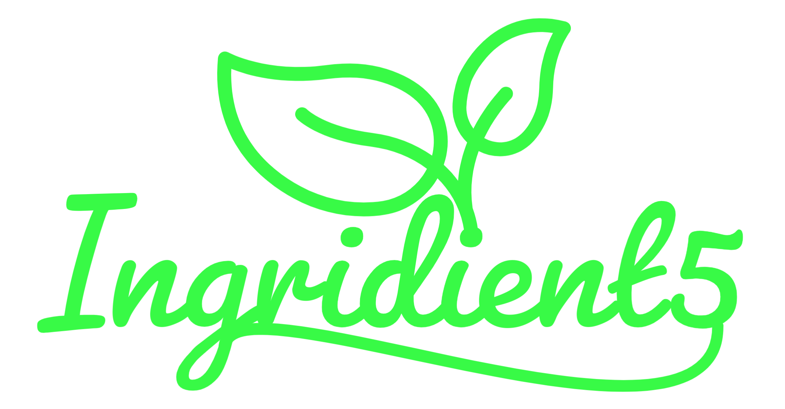

# Ingredient5
## The most delicious and simple dishes - with only 5 ingredients

[Click here for the full website access]()

## Table of contents
1. [Introduction](#introduction) 
2. [Preparation - UX and UXD](#preparation)
3. [Agile Development](#agile)
4. [Features](#features)
5. [Testing](#testing)
6. [Deployment](#deployment) 
7. [Credits / attributes](#credits) 

## Introduction 
Ingredient5 is a django web app that is all about cooking. 
In the app, users have the opportunity to choose and recreate delicious and simple dishes. 
The special thing about the recipes is that each dish consists of 5 ingredients, it is easy to cook and yet particularly delicious. 

So the goal of Ingredient5 is to make chefs of all kinds (whether beginners or professionals) with an empty fridge, look like star chefs.... And that with minimal effort!

The application has various features / functions, which are explained in more detail in strategy and features.

## Preparation - UX and UXD
As mentioned in the introduction, the app is aimed at a broad audience. Many people unfortunately suffer from lack of time and are not able to eat sensibly. Therefore, many people resort to supplements, unhealthy food (mostly fast food), or skip meals altogether. 

Often not only the time to cook is missing, but also the time to even go shopping in the supermarket. Ingredient5 tries to fill this gap. Simple and delicious meals with a limited fridge are thus possible and excuses regarding unhealthy food should be a thing of the past.

The **UXD - User Experience Design** was declared and described in advance and includes the 5 panels *strategy, scope, structure, skeleton and surface*. 

### Strategy 
What makes Ingredient5 special? 

The content:

The simplicity of the recipes, which make dishes look complex. This makes all the recipes easy to implement and meets exactly the nerve of the time, in which no one has the time and leisure to prepare a delicious meal. In addition, the dishes are universal, that is, whether they are cooked to eat alone, served to friends, or directly appeal to a large family celebration.

Associated functions in the app should also lead to a great and intuitive user experience. 
The principles of good UX apply: simple navigation, user feedback, custom settings and a quick sense of achievement. 

The app and its content is also culturally appropriate: it's aimed at cooking amateurs who don't yet know how to cook and need to cook, as well as experienced cooks looking for inspiration. No one is excluded. 

To structure the content and make the data retrievable, there are different models, explained in detail in the scope section.

---
### Scope 

To describe the scope of the Ingridient5 app, the key features will be discussed first. 

Users should be able to log in with a username and thereby create a personal account, which is necessary for the personalizing of the content. 
However, this also means that the other content is behind this authentication hurdle. Recipes cannot be viewed without an account, which should lead to a higher registration rate.

After authentication, further functions are available to the user. For example, they can actively search for new recipes (via django generic ListView) and view the recipes in detail. An own cookbook with favorite recipes can then be created via a bookmark function. 

Furthermore, users have the option of registering for a virtual cooking class. All that is required is to select an email address, date and time (date and time specified in each case). Afterwards, the user automatically receives a confirmation email with an access link and the admin receives an overview of the participants in the backend. 

What can not be implemented within the project, just because of lack of time? 
* Users will not have the possibility to reset the password at first.
* Excessive filtering options in the recipe overview will be reduced to a minimum for the time being.
* The number of recipes will probably be 20 - 25 maximum. 
* Users will not yet be able to pay online, but a fictitious invoice will be included in the mail. 

The scope, in terms of content, will stretch over 9 HTML pages.
* index.html
* signup.html
* login.html
* logout.html
* recipes.html
* recipes_detail.html
* cookbook.html
* workshop.html 
* 404 page

Here, further pages are omitted too due to time constraints. 
How the individual pages are composed is outlined in the structure section below. 

--- 
### Structure 

The structure of the app is kept very simple and is illustrated here for the sake of completeness. This results in a simple, clear and intuitive navigation for the user. 

---
### Skeleton 

In order to implement the pages safer, faster and more efficiently, wireframe models were created in advance. Excluded from this are the pages login, signup, logout and the 404page, as these are simple pages with either a form element or a feedback display. Wireframe models are therefore only created for more complex pages. 

The models for the index, recipes, recipes_list, cookbook, workshop are listed down below. 

---
### Surface

In terms of visual language, the main points that remain are colors, logo and fonts.
The color palette consists of the main color #38FA46 and some according compound colors. Down below you can see an abstract of the Adobe Color Wheel.

The app logo was created with the Adobe Express. The corresponding green should reflect the targeted healthy diet. 

Google Fonts was used for the typography and the icons. The font "Bebas Neue" is used for headlines and titles, the font "Ubuntu" is used for everything else.

## Agile Development

The entire project was developed in an agile manner. Particularly noteworthy is the sprint board (git hub project), on which the user stories and their status were recorded. For better traceability, the project was set to public. 

The user stories developed in advance were: 
* As an admin (employee of ingredient5), I would like to create recipes so that the users can explore the recipes.
* As an admin (employee of ingredient5), i would like to approve comments so that no inappropiate comments are on the site.
* As a site user, I want the ability to create an account, so that I can comment on recipes and create my own personal cooking book.
* As a site user, I want to see the recipes with the according comments, so that I can get new cooking ideas.
* As a user, I want to be able to comment on a recipe so that I can give feedback to the author and discuss it with other members.
* As a site user, I want to have a cookbook of my favorite recipes, so that I do not have to search them every time again.
* As a user, I want the ability to like (and at the same time bookmark) my favorite recipes so that i can store them in my own virtual cooking book.
* As a user, I want the ability to book (and cancel) a virtual cooking-workshop, so that I can enhance my cooking skills and interact with other people.

## Features
The following features were a decisive factor during the app creation: 
* 
* 
* 
* 

### Features for the future 
The following features would be ideas for further development...
* 
* 
* 

## Testing 

The page and its functionality was tested manually. This was done primarily using Chrome DevTools (Lighthouse), as well as the website http://www.responsinator.com/.
The layout was tested in portrait and landscape mode on the following devices: iPhone SE, iPhone XR, iPhone 12 Pro, Pixel 5, Samsung Galaxy S8+, Surface Pro 7, Surface Duo, Galaxy Fold, Samsung Galaxy A51/71, Nest Hub, Nest Hub Max and common monitors. No display errors were detected. If other devices show any, they would have to be improved afterwards. 

To test accessibility and SEO, Lighthouse was used. 

Furthermore, the W3C Validator was used to ensure that the HTML and CSS file are valid. No errors exist anymore at this moment. JShint was used to find errors in JavaScript code. In the corrected version there are currently only hints that some techniques can only be used with ES6, so the code is valid.

## Deployment 

[You can access the website right here](https://)

## Credits
