# Ingredient5
## The most delicious and simple dishes - with only 5 ingredients

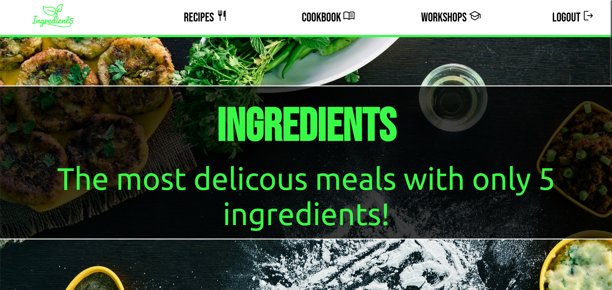

[Click here for the full website access]()

## Table of contents
1. [Introduction](#introduction) 
2. [Preparation - UX and UXD](#preparation)
3. [Agile Development](#agile)
4. [Features](#features)
5. [Testing](#testing)
6. [Deployment](#deployment) 
7. [Notes](#notes) 
8. [Credits / attributes](#credits) 

## Introduction 
Ingredient5 is a django web app that is all about cooking. 
In the app, users have the opportunity to choose and recreate delicious and simple dishes. 
The special thing about the recipes is that each dish consists of 5 ingredients, it is easy to cook and yet particularly delicious. 

So the goal of Ingredient5 is to make chefs of all kinds (whether beginners or professionals) with an empty fridge, look like star chefs.... And that with minimal effort!

The application has various features / functions, which are explained in more detail in strategy and features.

## Preparation - UX and UXD
As mentioned in the introduction, the app is aimed at a broad audience. Many people unfortunately suffer from lack of time and are not able to eat sensibly. Therefore, many people resort to supplements, unhealthy food (mostly fast food), or skip meals altogether. 

Often not only the time to cook is missing, but also the time to even go shopping in the supermarket. Ingredient5 tries to fill this gap. Simple and delicious meals with a limited fridge are thus possible and excuses regarding unhealthy food should be a thing of the past.

The **UXD - User Experience Design** was declared and described in advance and includes the 5 panels *strategy, scope, structure, skeleton and surface*. 

### Strategy 
What makes Ingredient5 special? 

The content:

The simplicity of the recipes, which make dishes look complex. This makes all the recipes easy to implement and meets exactly the nerve of the time, in which no one has the time and leisure to prepare a delicious meal. In addition, the dishes are universal, that is, whether they are cooked to eat alone, served to friends, or directly appeal to a large family celebration.

Associated functions in the app should also lead to a great and intuitive user experience. 
The principles of good UX apply: simple navigation, user feedback, custom settings and a quick sense of achievement. 

The app and its content is also culturally appropriate: it's aimed at cooking amateurs who don't yet know how to cook and need to cook, as well as experienced cooks looking for inspiration. No one is excluded. 

To structure the content and make the data retrievable, there are different models, explained in detail in the scope section.

---
### Scope 

To describe the scope of the Ingredients app, the key features will be discussed first. 

Users should be able to log in with a username and thereby create a personal account, which is necessary for the personalizing of the content. 
However, this also means that the other content is behind this authentication hurdle. Recipes cannot be viewed without an account, which should lead to a higher registration rate.

After authentication, further functions are available to the user. For example, they can actively search for new recipes (via django generic ListView) and view the recipes in detail. An own cookbook with favorite recipes can then be created via a bookmark function. 

Furthermore, users have the option of registering for a virtual cooking class. All that is required is to select an email address, date and time (date and time specified in each case). Afterwards, the user automatically receives a confirmation email with an access link and the admin receives an overview of the participants in the backend. 

What can not be implemented within the project, just because of lack of time? 
* Users will not have the possibility to reset the password at first.
* Excessive filtering options in the recipe overview will be reduced to a minimum for the time being.
* The number of recipes will probably be 30 - 40 maximum. 
* Users will not yet be able to pay online, but a fictitious invoice will be in the mail. 

The scope, in terms of content, will stretch over 8 HTML pages.
* index.html
* signup.html
* login.html
* logout.html
* recipes.html
* recipes_detail.html
* cookbook.html
* workshop.html 

Here, further pages are omitted too due to time constraints. 
How the individual pages are composed is outlined in the structure section next.

As for the scope of the database and what schema is behind it, can be well described by the following figure.

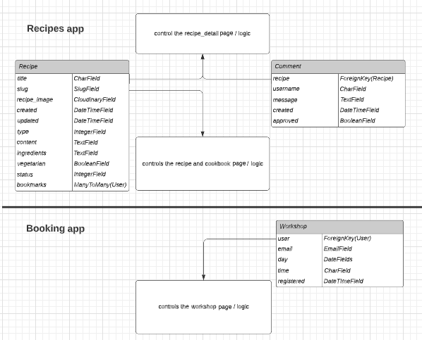

Ingredients is divided into two Django apps: Recipes and Booking. 

Recipes consists of the Recipe and Comment models, where Recipe affects all pages related to the overall view of recipes, the detailed view of recipes and the cookbook. Comment controls only the comment section part of the recipe detail view. 

The Booking app is a separate branch and therefore it's model (Workshop) is independent from the other models and acts with the fields listed above. It is only tasked to support the workshop page and logic, nothing more and nothing less. 

--- 
### Structure 

The structure of the app is kept very simple and is illustrated here for the sake of completeness. This results in a simple, clear and intuitive navigation for the user. 

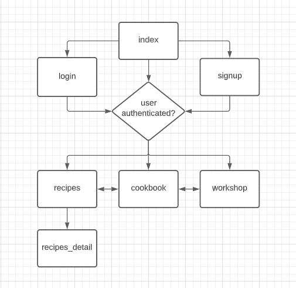

---
### Skeleton 

In order to implement the pages safer, faster and more efficiently, wireframe models were created in advance. Excluded from this are the pages login, signup, logout and the 404page, as these are simple pages with either a form element or a feedback display. Wireframe models are therefore only created for more complex pages. 

The models for the index, recipes, recipes_list, cookbook, workshop are listed down below. 

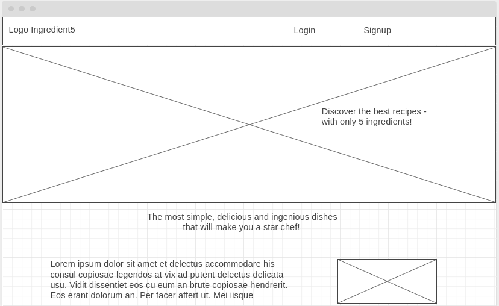

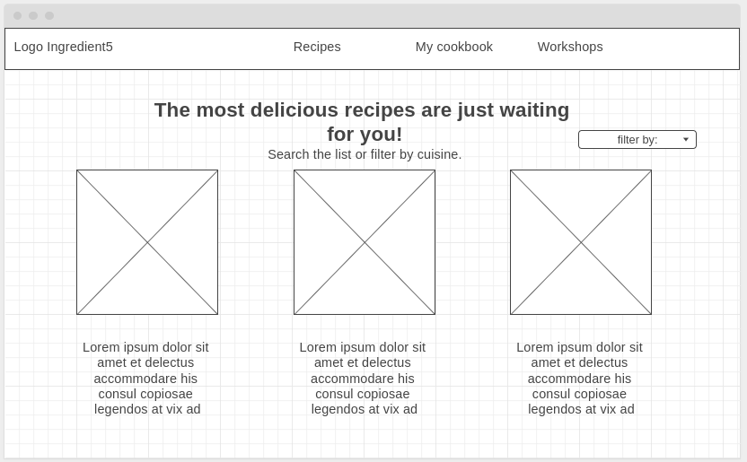

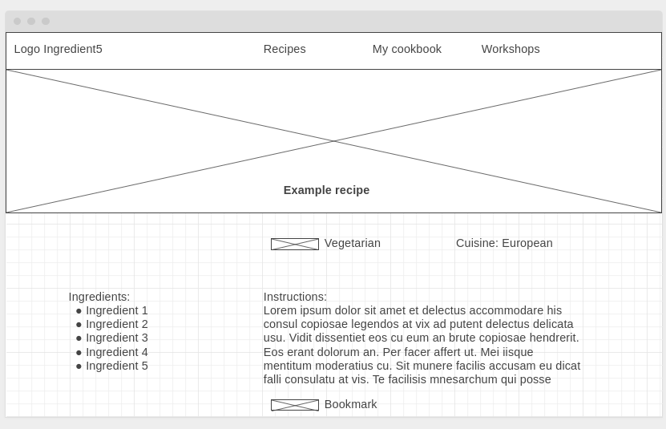

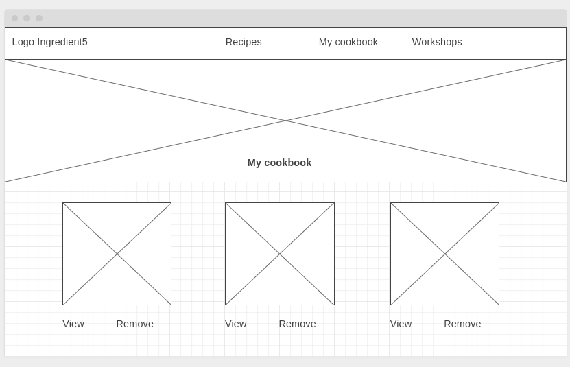

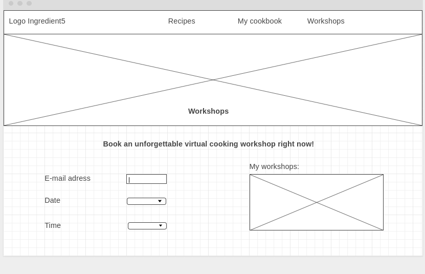

---
### Surface

In terms of visual language, the main points that remain are colors, logo and fonts.
The color palette consists of the main color #38FA46 and some according compound colors. Down below you can see an abstract of the Adobe Color Wheel.

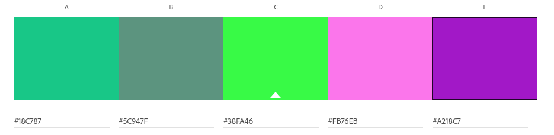

The app logo was created with the Adobe Express. The corresponding green should reflect the targeted healthy diet. To clear up any confusion: The figurative mark replaces the "S" with a 5, but the word mark has this S to make it clear that the name is to be understood in the plural and not "Ingredient Five". 

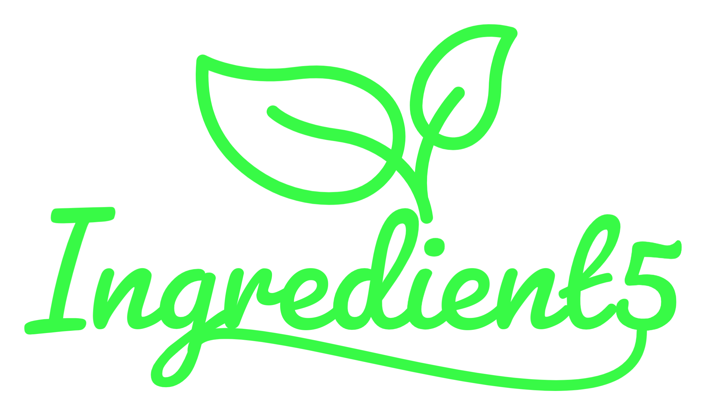

Google Fonts was used for the typography. The font "Bebas Neue" is used for headlines and titles, the font "Ubuntu" is used for everything else. The icons in the app are also from Google (Google Icons). All content from Google is not provided via a CDN, but has been downloaded. 

## Agile Development

The entire project was developed in an agile manner. Particularly noteworthy is the sprint board (git hub project), on which the user stories and their status were recorded. For better traceability, the project was set to public. 

To make it clearer, the user stories were divided into epics (unfortunately not visible in the sprint). For the sake of completeness, the epics with the corresponding stories are listed here once again. 

### Admin Epic:
**Introduction:**

In the following, we will first outline what the biggest problems and challenges for the admin are and how they are solved. In addition, we will consider how the starting position can also be improved sustainably for the admin and how the right foundation can be laid. 

The admin is author, control unit and contact person in one for the ingredients community and therefore has many requirements. All requirements must therefore be clearly manageable in the backend area and without major technical knowledge. 

Therefore, different panels for these areas are created in the admin area and filterable settings are created so that the search is faster and more efficient. Furthermore, it is important that there are not too many actions for comments, workshops or recipes to keep it simple. 

**Goals & Outcomes:**

Even relatively new employees find their way around the backend within a few days. Creating new recipes is very quick, as is checking and approving comments. 

Clear **user acceptance criteria** are generally: simplicity, structuredness, great design, workshops as an experience. This is the only way Ingredients can establish itself as a source of cooking ideas. 

In addition, all information on workshops can be called up in this control center in order to prepare optimally. 

The user stories developed for the admin were:

* As an admin (employee of ingredient5), I would like to create recipes so that the users can explore the recipes.
* As an admin (employee of ingredient5), i would like to approve comments so that no inappropiate comments are on the site.
* As an admin (employee of ingredient5), i would like to get an overview of the workshop participants so that everything can be prepared accordingly.

All user stories are must have stories!

The admin stories can be broken down even further into tasks: 

* Create a backend form that allows the admin to add new recipes quickly and easily.
* Implement the ability to approve comments that are initially locked. 
* Create a workshop area in the backend where users are assigned to booked workshops. 

### User Epic:
**Introduction:**

In this section, we will first outline what the biggest problems and challenges for the users are and how they are solved. The user is the linchpin of the app and is therefore always brought to the fore during development. User experience and design must therefore never be neglected and are continuously improved. 

**Goals & Outcomes:**

One of the most important measures and goals is to create an attractive index page that attracts users. To increase the registration rate, all content and functions are only accessible with an account. 

The menu navigation as well as the CRUD operations are self-explanatory and no problem even for inexperienced internet users. 

Great recipes make you want more, which should increase the registration rate of the workshops and thus also the turnover. 

The user stories developed for the user were:

* As a site user, I want the ability to create an account, so that I can comment on recipes and create my own personal cooking book.
* As a site user, I want to see the recipes with the according comments, so that I can get new cooking ideas.
* As a user, I want to be able to comment on a recipe so that I can give feedback to the author and discuss it with other members.
* As a site user, I want to have a cookbook of my favorite recipes, so that I do not have to search them every time again.
* As a user, I want the ability to like (and at the same time bookmark) my favorite recipes so that i can store them in my own virtual cooking book.
* As a user, I want the ability to book (and delete) a virtual cooking-workshop, so that I can enhance my cooking skills and interact with other people.

All user stories are must have stories!

The resulting tasks look like this: 

* Create an authorization option for any user who wants to sign up.
* Build an individual comment section for each dish. 
* Code a comment function
* Create a personal cookbook for every user
* Implement the bookmark function to save dishes to the cookbook
* Code a workshop section with an acoording model, view and template in a separate app 

Down below, you can see the sprint board in action during development.

## Features
The Ingredients app has many features, which will now be examined in more detail below. 

The app has only custom css code, which is around a thousand lines long. Highlights are of course the reponsiveness on all devices, a color effect in the hero image and many media queries. Compared to other websites / apps, responsiveness is even more important in the context of cooking, because people at the stove look on smartphones and tablets, not on desktop computers.  Bootstrap was not used, because I personally find the styling with flexbox and grid more pleasant and the html files do not have umpteen div nestings. Bootstrap tends to mix styling and structure. 

Another feature are the present and working CRUD operations that the user can perform in the frontend.
These include: 

* the creation of comments
* the creation of accounts 
* the creation of workshop registrations
* reading comments
* reading recipes
* updating the cookbook (by deleting dishes)
* updating the list of recipes by filtering them
* deleting recipes from the cookbook 
* deleting workshops from the personal reminder section  

Users also get feedback on all CRUD operations and database states.
This includes: Feedback...

* when a comment was left and is being approved.
* when a recipe got bookmarked.
* when a recipe got removed from the cookbook.
* when the cookbook is empty.
* when a workshop was booked.
* when the workshop list is empty.

The approach to the corresponding feedback was different, depending on the context in which the feedback appears. Often variables were queried in template tags to indicate feedback. For the cookbook and the removal of recipes, Django messages were used. Hereby I wanted to show that there are different approaches to give user feedback. 

A special feature is also the automatic sending of emails, which was implemented with the help of the built-in send_email function of Django. For this purpose a new gmail account was created especially for ingredients. Down below you can see an example email, which can be improved in the future.

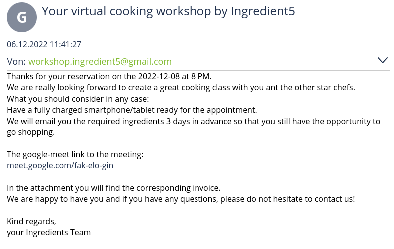

### Features for the future 
The following features would be ideas for further development...
* The independent cancellation of workshops. This was not implemented, as this is also related to the fictitious accounting system. Therefore, this is still the task of the admins. 
* More filtering options of the recipes (for example, whether it is vegetarian or not), or a search bar.  However, since it is "only" 34 dishes for now, a filter option by region is perfectly sufficient. Anything else would be over-engineered.
* An account setting section. Here users could tell something about themselves and choose an avatar, which would be visible to other users. 

## Testing 

The page and its functionality was tested manually as well as automatically. For a better overview, these two areas are now treated separately from each other. 

**Manual testing**

Manual testing was done primarily using Chrome DevTools (Lighthouse) and validators for HTML, CSS, JavaScript and Python.

The layout was tested in portrait and landscape mode on the following devices: iPhone SE, iPhone XR, iPhone 12 Pro, Pixel 5, Samsung Galaxy S8+, Surface Pro 7, Surface Duo, Galaxy Fold, Samsung Galaxy A51/71, Nest Hub, Nest Hub Max and common monitors. No display errors were detected. If other devices show any, they would have to be improved afterwards. 

To test accessibility and SEO, Lighthouse was used. 

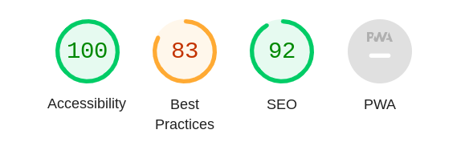

The test results of Best Practices are slightly worse than those of Accessibility and SEO, because images with somewhat low resolution were also used (especially in the Recipes section). Of course, this has to do with the fact that the images should fit the dishes and only these were available. If time had allowed, the search for high-resolution images would be something to look into. 

Furthermore, the W3C Validator was used to ensure that the HTML and CSS file are valid. Since the template engine of Django causes problems with validation, the Django logic was removed. That is: All template tags were removed and all src and href values were replaced with an "#". You can find the according HTML files under ./templates/tests. The clean HTML files are free of errors and warnings.

Testing the CSS and JS files was much easier since there were no templates implemented. There were no errors here, only a missing semicolon in the JavaScript file for the hamburger menu. 

All python files comply with the PEP 8 guideline, the only exception being a small paragraph within ingredient5/settings.py, where a few lines are too long. The reason for this is that these lines already appear in the default state and are intended to be so. Therefore, these lines are not touched to ensure the functionality of the app.  

However, the manual testing was not over yet... The functionality of the site was performed by several people, on several devices, with several users logged in. 

Small errors appeared at first. For example, the error notifications at login and signup were not considered, causing graphic errors and fields flowing out of the form. This was subsequently corrected in the corresponding CSS files. 

A major error within the business logic was only noticed by using multiple users, because the cookbook was the same for all users. Here, a crucial error had crept into the view, which however could also be fixed with a few lines of code. 

An error that still remains is the sending of automatic mails in dev-mode (debug=True), because here a 500 error code appears. Here a suitable solution was searched for a long time, however, so far remained unclear, why the error appears. Since the function is fully functional when the page is live (debug=False), this is rather negligible. 

**Automatic testing**

In addition to manual testing of the application, a small test suite was also written. However, it must be emphasized that this is not a classic TDD approach and therefore there was no red-green-refactor cycle. The tests were not written in advance, but rather at the same time or afterwards. This is because the size of the project simply allowed this approach. In a larger project, it would also be worthwhile to use test-driven development to save time and resources. 

To make the tests possible in the first place, the postgres database is replaced by the default sqlite3 database that comes with Django. The database configuration is located in the settings.py file in the ingredient5 folder (single location) where it can be changed easily.

First and foremost, the test suites for both apps, i.e. "Recipes" and "Booking", consist of basic tests that: 
- check the default values of the models for their correctness.
- make sure that the required fields in the forms are also presupposed.
- check if the views or the templates are reachable. 

The suite consists of 11 tests, all of which pass at the time of project release.
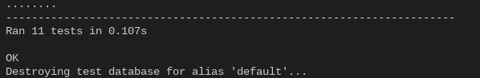

## Deployment 

[You can access the website right here](https://)

## Notes

## Credits
**Recipe content**

I do not take credit for creating any content on Ingredients. 
Since time was very limited, external resources had to be used to create the content. One site that helped me is one of my favorites: the German site chefkoch.de. 

The complete content is based on this site and therefore the recipes and the pictures are property of the chefkoch contributors. My part or work was to find the appropriate recipes, break them down to the most important ingredients and translate the content into English. To make it transpartent and accurate, here is a list of the complete recipes including the URL: 

European recipes:

https://www.chefkoch.de/rezepte/1574651265014378/Serviettenknoedel.html

https://www.chefkoch.de/rezepte/1342861239100533/Tortellini-alla-panna.html

https://www.chefkoch.de/rezepte/975941203236020/Ricotta-Gnocchi.html

https://www.chefkoch.de/rezepte/1066811212153175/Schwedische-Sommersuppe.html

https://www.chefkoch.de/rezepte/79221030372046/Kaesespaetzle.html

https://www.chefkoch.de/rezepte/2657201417258206/Passatelli-Suppeneinlage-aus-Italien.html

https://www.chefkoch.de/rezepte/1106901216798497/Mallorquinische-Knoblauchsuppe.html

https://www.chefkoch.de/rezepte/596101159262249/Meeresfruechtesalat-mit-Weissweinessig.html

Asian recipes:

https://www.chefkoch.de/rezepte/2813211433323231/Dal-indisches-Linsengericht.html

https://www.chefkoch.de/rezepte/353751120668411/Bakso-indonesische-Suppe.html

https://www.chefkoch.de/rezepte/1810651293294338/Gruene-Bohnen-mit-Sesamdressing.html

https://www.chefkoch.de/rezepte/322441114215643/Japanische-kalte-Buchweizennudeln-mit-Dip.html

https://www.chefkoch.de/rezepte/1206351226352292/Scampi-in-scharfer-Kokosnuss-Sauce.html

https://www.chefkoch.de/rezepte/677721170159832/Bananencurry.html

https://www.chefkoch.de/rezepte/656681167383995/Pinkantes-Moong-Dal.html

Arabic recipes:

https://www.chefkoch.de/rezepte/2365241375652232/Shakshuka.html

https://www.chefkoch.de/rezepte/1287271234164583/Kichererbsensalat-mit-getrockneten-Tomaten-und-Feta.html

https://www.chefkoch.de/rezepte/3523631525635946/Libanesische-Kartoffeln-mit-Koriander-Kreuzkuemmel-und-Chili.html
https://www.chefkoch.de/rezepte/2001941324053248/Usbekische-Samsa-oder-Samsy.html

https://www.chefkoch.de/rezepte/1130871219489506/Rote-Nudelsuppe.html

https://www.chefkoch.de/rezepte/1345641239312534/Khorescht-e-Gheymeh.html

https://www.chefkoch.de/rezepte/2001961324053940/Beshbarmak.html

African recipes:

https://www.chefkoch.de/rezepte/3347651497529252/Afrikanisches-Stew.html

https://www.chefkoch.de/rezepte/2036131329920039/Suesskartoffelstampf-mit-Limone-und-Gewuerzaromen.html

https://www.chefkoch.de/rezepte/1735881282587859/Mango-Chili-Relish.html

https://www.chefkoch.de/rezepte/428791133906816/Afrikanischer-Eintopf.html

https://www.chefkoch.de/rezepte/2262131361561169/Matapa-Kohleintopf-mit-Erdnuessen-und-Kokosnussmilch.html

https://www.chefkoch.de/rezepte/3348371497623382/Foul-Medammas.html

North-/Southamerican recipes: 

https://www.chefkoch.de/rezepte/3094091462129184/Schnelles-Pulled-Chicken.html

https://www.chefkoch.de/rezepte/3005031453373187/Grilled-Cheese-Sandwich-mit-Bacon-und-Spiegelei.html

https://www.chefkoch.de/rezepte/2491001391614525/Bohneneintopf-kanadische-Art.html

https://www.chefkoch.de/rezepte/888591194428232/Argentinisches-Rodeo.html

https://www.chefkoch.de/rezepte/743621176974335/Ceviche-de-Camarones.html

https://www.chefkoch.de/rezepte/34011009469977/Fische-Bahia.html

**Code-related**

At this point I would first like to mention the course content from CodeInstitute. Here the DjangoBlog and HelloDjango project were crucial idea givers and templates. The models and views of the Recipes app are partly based on these projects. 

In addition, there are other sources to mention: 
* The hamurger menu is inspired by Miguel Nunez, source: https://www.youtube.com/watch?v=flItyHiDm7E)
* The model of the Booking app is a modified, yet own model, which is inspired from the following article by John Abdsho Khosrowabadi: https://blog.devgenius.io/django-tutorial-on-how-to-create-a-booking-system-for-a-health-clinic-9b1920fc2b78
* The use of the send_mail function was encouraged by Codemy.com, in particular by the following video: https://www.youtube.com/watch?v=rHZwE1AK1h8&t=490s

**Images**

As already mentioned, the pictures of the recipes are due to the users of chefkoch or chefkoch itself. 
Other image sources: 

* Jimmy Dean: https://unsplash.com/photos/my1mDMraGf0
* Pablo Merchán Montes: https://unsplash.com/photos/Orz90t6o0e4
* adilsphotography: https://unsplash.com/photos/gmo6Ok9G0U8

